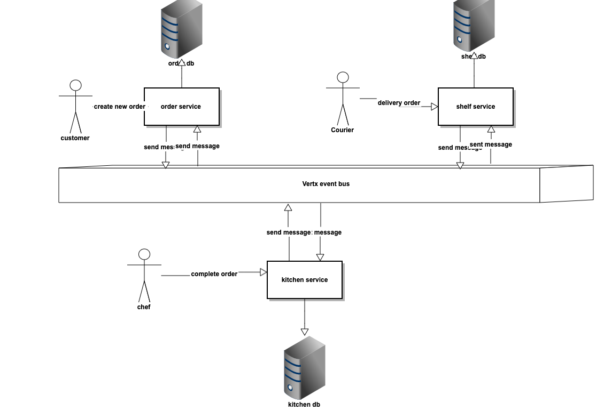

## Air Factory

You need to have the following tools installed.

- java8 
- maven3
- docker  
- docker-compose

### Services
- order
- delivery
- factory
- monolith

### How to Run on microservices model
steps

```
1 mvn clean install

2 docker network create --subnet 10.5.0.0/24 local_network_dev

3 docker-compose up --build
```

Check the started containers 

```
94d57c79a0e3        factory             "/deployments/run-ja…"   3 hours ago         Up 52 seconds              8778/tcp, 0.0.0.0:8083->8083/tcp, 9779/tcp   
7ad9647400ea        delivery            "/deployments/run-ja…"   3 hours ago         Up 52 seconds              8778/tcp, 0.0.0.0:8082->8082/tcp, 9779/tcp   
4794c8cfeaa7        order               "/deployments/run-ja…"   3 hours ago         Up 52 seconds              8778/tcp, 0.0.0.0:8081->8081/tcp, 9779/tcp   

```


### How to Run on monolith model
```
1 mvn clean install
2 java -jar /monolith/target/monolith-1.0-SNAPSHOT-runner.jar
```
You also can build monolith's docker image.

### Logic Diagram


### Rest Apis
1 create order
   ````
    curl -v -X POST -H 'Content-Type: application/json' --data '{"name":"test4","temp":"FROZEN","shelfLife":1001,"decayRate":101}' localhost:8081/order/new
   ````
2 complete order
  ````
    curl -v -X POST -H 'Content-Type: application/json' --data '{"name":"test4","temp":"FROZEN","shelfLife":1001,"decayRate":101,”id”:2 }’  localhost:8083/kitchen/ready
   
   ````
3 delivery order
 ````
    curl -v -X POST -H 'Content-Type: application/json' --data '{"name":"test4","temp":"FROZEN","shelfLife":1001,"decayRate":101,”id”:2 }’  localhost:8083/shelf/completed
   
   ````
If using monolith model, please change port to *8088*.

